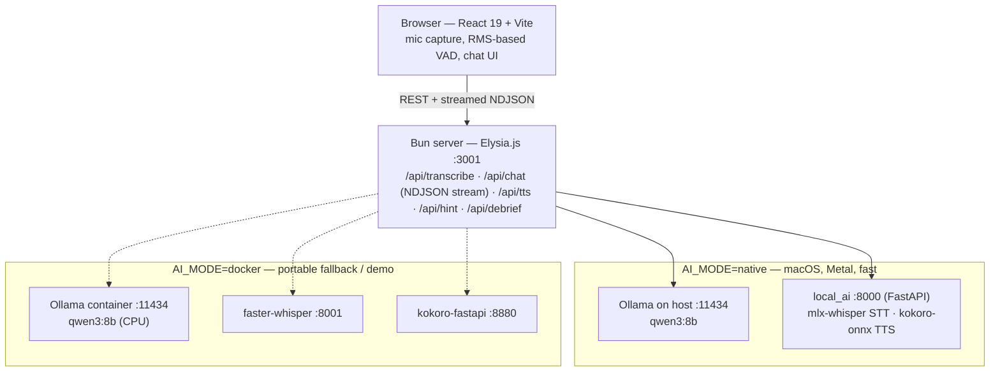
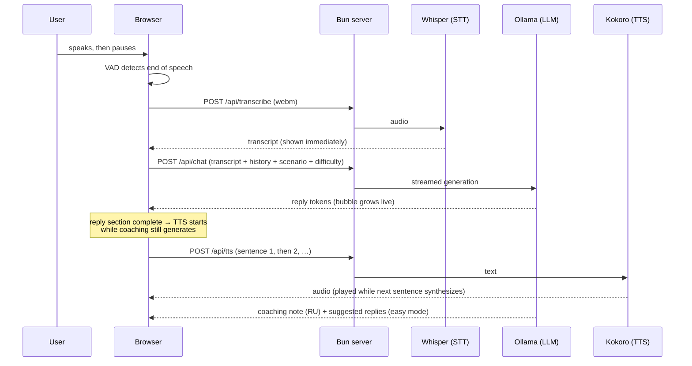

# Speech Up — AI English Speaking Coach

A local, privacy-first speaking trainer that improves your **spoken** English **without any human involvement**.

## Goal

The target user already understands English well by ear and reads fluently, but has little to no real conversation experience. Speech Up takes them from *"I understand but freeze when I have to speak"* to **speaking confidently**: it creates realistic conversation situations, gives unlimited safe practice, never interrupts thinking pauses, and coaches (in Russian) on how to sound more natural — so regular sessions translate directly into confidence in real-life English conversations: interviews, standups, technical and casual talk.

Everything runs on your machine. No cloud, no accounts, no one listening.

## How it works

- **The AI speaks first** — pick a scenario (job interview, daily standup, tech discussion, casual chat) and answer; answering is easier than starting from a blank page.
- **It never cuts you off** — voice detection waits through long thinking pauses (configurable 1–5 s).
- **Difficulty levels** — *Easy*: simple language + 2 suggested replies every turn (tap to hear one, then say it); *Medium*: an "I'm stuck" button for hints on demand; *Hard*: natural speech with idioms, no help.
- **Coaching in Russian** — after each of your turns, a short text note: grammar slips, more natural phrasings. Never spoken, never interrupting.
- **Session review** — a "Finish" button generates a debrief: your phrases vs. how a native would say them, vocabulary to remember.
- **Feels live** — the reply streams in token by token and the voice starts speaking sentence-by-sentence while the coaching note is still generating. Voice can be toggled off entirely for the fastest text-only turns.

## Architecture



In native mode the Bun server auto-starts `ollama serve` and `local_ai` on boot and kills them on exit — the AI stack runs only while you practice.

### One conversation turn



## Tech stack

| Layer | Technology |
|---|---|
| Frontend | React 19, Vite 8, TypeScript, Tailwind CSS v4, shadcn/ui |
| Backend | Elysia.js on Bun (port 3001) |
| LLM | Ollama — `qwen3:8b` (strong Russian+English bilingual 8B) |
| STT | mlx-whisper (native) / faster-whisper `large-v3-turbo` (docker) |
| TTS | kokoro-onnx (native) / kokoro-fastapi (docker), 40+ English voices |
| Voice capture | Web Audio API (RMS-based VAD) + MediaRecorder, zero VAD dependencies |

## Daily use

```bash
bun start                   # builds the UI, serves app + API on :3001, opens the browser
```

One command, one process: the production frontend build is served by the Bun server itself (no Vite dev server), and in native mode the AI stack is auto-started alongside and killed on exit.

## Development Setup

Two AI-stack modes, switched by `AI_MODE` in `.env` (see `.env.example`):

### Docker mode (default — works anywhere, good for demo)

```bash
bun install
docker compose up -d        # Ollama + faster-whisper + Kokoro (CPU)
bun dev:server              # Elysia backend on :3001
bun dev                     # Vite dev server on :5173, proxies /api → :3001
```

### Native mode (macOS, Metal GPU — much faster)

One-time setup:

```bash
brew install ollama
ollama pull qwen3:8b
python3 -m venv local_ai/.venv
local_ai/.venv/bin/pip install -r local_ai/requirements.txt
```

Then set `AI_MODE=native` in `.env` and just:

```bash
bun dev:server              # auto-starts ollama serve + local_ai, kills them on exit
bun dev
```

Whisper (mlx, ~1.6 GB) and Kokoro (~330 MB) models download automatically on first start. Don't run the docker `ollama` service at the same time — both want port 11434.

## More

Detailed project context, decisions, gotchas, and the phased roadmap live in [CONTEXT.md](CONTEXT.md).
